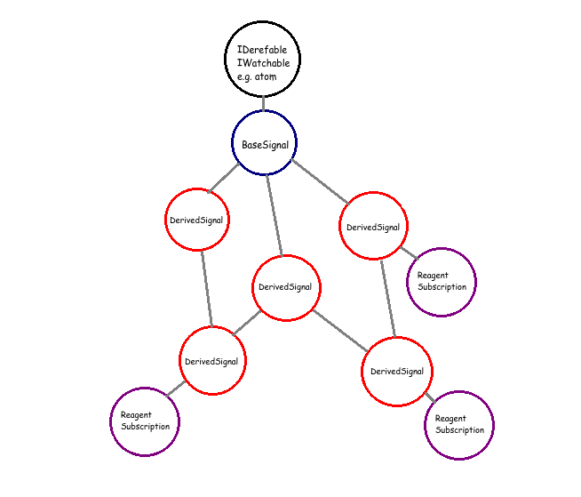
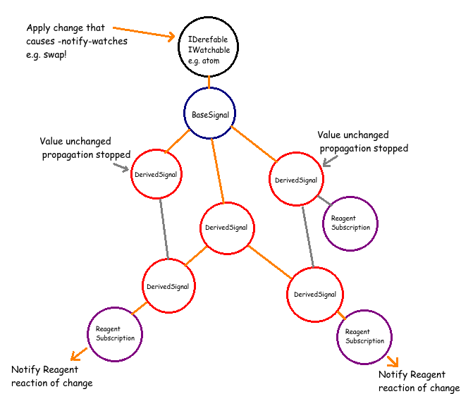
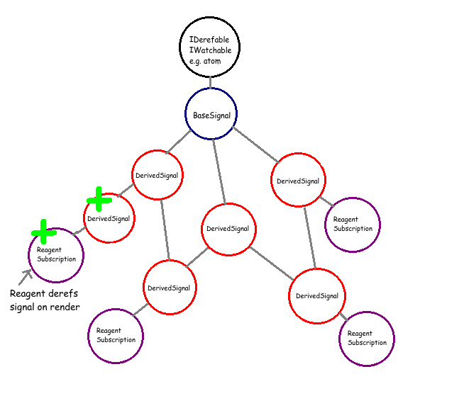
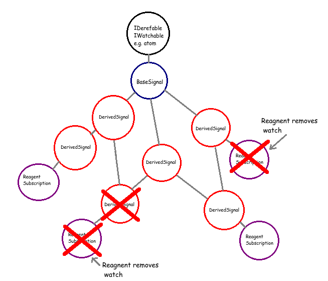

# Sigsub

A signal network management library for supplying reactive data to [Reagent]
(http://github.com/reagent-project/reagent)
components.

__Warning__: This library is in a very early stage of development.

[](http://clojars.org/sebluy/sigsub)

# Usage

Basic setup and functionality:

```clj

(:require [sigsub.core :as sigsub :include-macros :true])

(def db (atom {:a 1}))

(sigsub/register-default-signal-skeleton
  (sigsub/get-in-atom-run-fn db))

(defn a-component []
  (sigsub/with-reagent-subs
    [a [:a]]
    (fn []
      [:div @a])))

;;=> renders [:div 1]

(swap! db assoc :a 2)

;;=> renders [:div 2]

```

Derived data:

```clj

(reset! db {:a 1})

(sigsub/register-signal-skeleton
  [:inc-a] ;<= path
  (sigsub/with-signals
    [a [:a]] ;<= dependency
    (fn []  
      (inc @a)))) ;<= functional relationship

(defn inc-a-component []
  (sigsub/with-reagent-subs
    [inc-a [:inc-a]]
    (fn []
      [:div @inc-a])))

;;=> renders [:div 2]

(swap! db assoc :a 2)

;;=> renders [:div 3]

```

See [tests](https://github.com/sebluy/sigsub/blob/master/test/sigsub/core_test.cljs) for more examples.

# Explanation

This library is an attempt to implement a subscription model similar to [re-frame's](https://github.com/Day8/re-frame) while maintaining the following constraints:

1. Only one signal exists for any subscription regardless of how many subscriptions are made to the signal.

3. Signals are held in memory and recompute their values as their parents change only if at least one subscription is made to the signal.

2. Signals recompute their current value only when an immediate parent signal changes value (using = not identical?).

# Pictures

Static network:


Network responding to change:


Network adds new signal:


Network removes unused signals:



